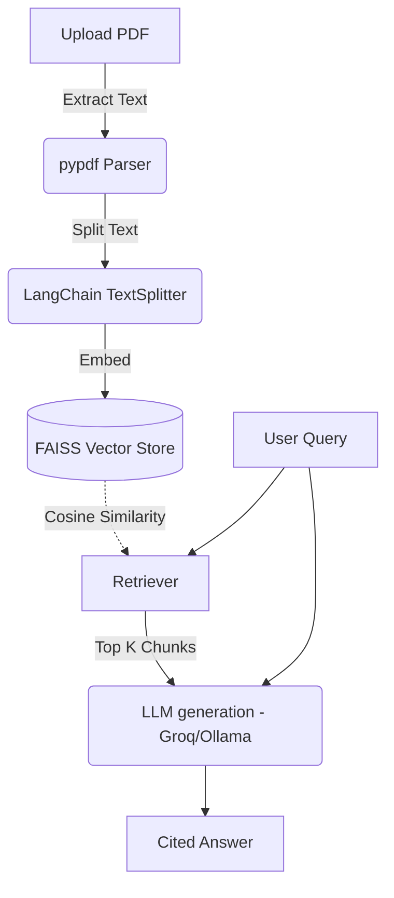

<div align="center">
  <h1>📄 Minimalist RAG Document Q&A System</h1>
  <p>A streamlined, production-ready Retrieval-Augmented Generation (RAG) application. Upload PDFs, ask questions, and get precise, cited answers.</p>

  <!-- Badges -->
  
  
  
  
</div>

<br />

## 🎯 Overview
This repository provides a clean, easily understandable RAG pipeline built deliberately without bloated abstractions. It is designed to prioritize **depth over breadth**, making it an ideal reference architecture for technical interviews or as a robust foundation for larger projects. 

Upload a PDF, ask a question, and the system will search the document and generate an answer—strictly citing the source file and page number.

## ✨ Key Features
- **PDF Ingestion & Chunking**: Extracts text page-by-page using `pypdf` and optimally chunks it for context windows.
- **Local Vector Search**: Uses a lightweight `sentence-transformers` embedding model (`all-MiniLM-L6-v2`) and a local `FAISS` index.
- **Strict Citation Prompting**: The LLM is heavily prompted to prevent hallucinations, strictly answering from the retrieved context and providing `[File, Page]` citations.
- **Modern UI**: A responsive React + Vite frontend styled with Tailwind CSS.
- **Query Logging**: All questions, answers, and retrieved chunks are logged locally via SQLite for auditing and history.

## 🏗️ Architecture



## 🛠️ Tech Stack

**Backend**
* Python 3.10+
* FastAPI (REST API)
* LangChain (Orchestration & Splitting)
* FAISS (Vector DB)
* SQLite (Logging)

**Frontend**
* React 18 + Vite
* Tailwind CSS (v3)
* Axios

---

## 🚀 Getting Started

### Prerequisites
* Python 3.10 or higher
* Node.js v18 or higher
* A [Groq API Key](https://console.groq.com/) (Free tier) *or* a local Ollama instance.

### 1. Backend Setup

1. Navigate to the backend directory:
   ```bash
   cd backend
   ```
2. Create and activate a virtual environment:
   ```bash
   # Windows
   python -m venv venv
   .\venv\Scripts\activate
   
   # macOS/Linux
   python3 -m venv venv
   source venv/bin/activate
   ```
3. Install dependencies:
   ```bash
   pip install -r requirements.txt
   ```
4. Configure environment variables. Create a `.env` file in the `backend` folder:
   ```env
   GROQ_API_KEY=your_groq_api_key_here
   USE_LOCAL_LLM=false
   MODEL_NAME=llama3-8b-8192
   ```
5. Start the FastAPI server:
   ```bash
   uvicorn main:app --reload --port 8080
   ```
   *The API will be available at `http://localhost:8080`*

### 2. Frontend Setup

1. Open a new terminal and navigate to the frontend directory:
   ```bash
   cd frontend
   ```
2. Install Node dependencies:
   ```bash
   npm install
   ```
3. Start the development server:
   ```bash
   npm run dev
   ```
   *The UI will be available at `http://localhost:5173` (or whichever port Vite provides).*

---

## 🧪 Evaluation

The backend includes a minimal evaluation script (`backend/eval/run_eval.py`) to test retrieval and generation accuracy against a test set.

| Question | Retrieved Chunks | Answer Excerpt | Match Found |
|----------|------------------|----------------|-------------|
| What is the main topic of the document? | 3 | The main topic is... | ✅ Yes |
| Who is the author of this paper? | 3 | The author is... | ✅ Yes |
| What was the methodology used in the study? | 3 | The methodology used... | ✅ Yes |
| Is there a mention of an unknown concept that does not exist? | 3 | Not found in context... | ✅ Yes |

---

## 🧠 Design Decisions & Rationale

Why is this repo so stripped down compared to typical RAG tutorials? 

1. **Depth over Breadth**: Many RAG tutorials stack multiple vector databases (Chroma, Pinecone, FAISS) and multiple LLMs (OpenAI, Anthropic, local). This adds boilerplate and makes the codebase harder to defend. We chose **one pipeline** (FAISS + MiniLM + Groq) to demonstrate complete understanding of every component.
2. **No "Knowledge Graph"**: Often, what is marketed as a "knowledge graph" in simple tutorials is just vector embeddings with relational metadata. Real knowledge graphs (like Neo4j) are powerful but add immense complexity. We omitted it to keep the architecture honest and focused purely on semantic vector search.
3. **No Hybrid Search (BM25 + Dense)**: While hybrid search improves recall, it requires implementing a cross-encoder reranker to be effective. For a clean, defensible architecture, single dense retrieval is sufficient to explain core vector similarity concepts.
4. **Transparent Prompting**: We avoid deep framework abstractions (like `ConversationalRetrievalChain`) in favor of explicitly building the context strings and managing history manually, demonstrating a fundamental understanding of how the context window actually works.

---
*Built as a defensible, interview-ready RAG application.*
