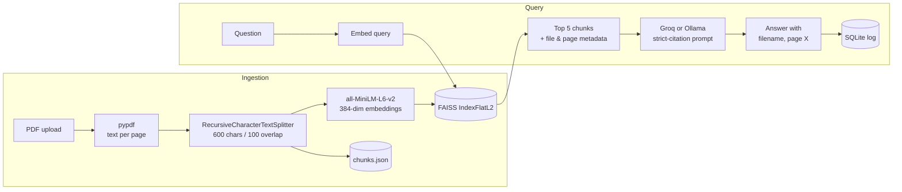

# RAG Document Q&A

Ask questions about your PDFs and get answers that cite the file and page they came from.

Upload a PDF through the web UI. The backend extracts the text page by page, splits it into
overlapping chunks, embeds them locally, and stores the vectors in a FAISS index. When you ask a
question, the five nearest chunks are pulled from the index and passed to an LLM under a prompt
that permits it to answer *only* from that context. If the answer isn't in the retrieved text, the
model returns `Not found in context.` rather than guessing.

The pipeline is written out in plain Python instead of being hidden behind a framework chain, so
every step (parse, chunk, embed, retrieve, prompt, log) is a file you can open and read in a minute.

---

## How it works



**Ingestion** happens in a FastAPI background task, so `POST /api/upload` returns as soon as the file
is on disk. Text is extracted with `pypdf`, whitespace-normalised, and split with
`RecursiveCharacterTextSplitter` on paragraph, line, sentence, then word boundaries. Each chunk keeps
its source filename and page number. Chunks are appended to `chunks.json`; their embeddings are
appended to the FAISS index in the same order, so FAISS position *i* resolves to chunk *i*.

**Retrieval** embeds the question with the same model and runs an exhaustive L2 search over the
index. Note that vectors are not normalised, so this is Euclidean distance rather than cosine
similarity.

**Generation** formats each chunk as `[filename, page N]: text` and hands the block to the model at
`temperature=0`. Citations are then parsed back out of the answer with a regex and de-duplicated, so
the frontend can list sources separately from the prose. Every question, answer, and the exact
chunks used are written to SQLite.

---

## Project layout

```
RAG Document/
├── backend/
│   ├── main.py                  FastAPI app, CORS, startup hooks
│   ├── config.py                Pydantic settings, all paths and tunables
│   ├── routes/query.py          /upload, /query, /history
│   ├── ingestion/
│   │   ├── parser.py            PDF -> list of pages
│   │   └── chunker.py           pages -> chunks + chunks.json persistence
│   ├── retrieval/
│   │   ├── embedder.py          model load, index build/append
│   │   └── retriever.py         query embedding, top-k search
│   ├── generation/
│   │   ├── prompt_templates.py  the citation-enforcing system prompt
│   │   └── llm_client.py        Groq / Ollama switch, context assembly
│   ├── storage/db.py            SQLite schema, query logging, history
│   ├── eval/run_eval.py         keyword-match harness over a test set
│   └── data/                    raw PDFs, FAISS index, chunks.json (gitignored)
└── frontend/
    └── src/
        ├── api/client.js        axios instance
        ├── App.jsx
        └── components/          UploadBox, QueryBox, AnswerPanel, HistorySidebar
```

---

## Requirements

- Python 3.10 or newer
- Node.js 20.19+ or 22.12+ (Vite 8 requirement)
- A [Groq API key](https://console.groq.com/), or a local [Ollama](https://ollama.com/) instance if
  you would rather not call a hosted model

The embedding model runs locally. On first launch `sentence-transformers` downloads
`all-MiniLM-L6-v2` (about 90 MB) and caches it in your Hugging Face cache directory.

---

## Setup

### Backend

```bash
cd "RAG Document/backend"
python -m venv venv
```

Activate it with `venv\Scripts\activate` on Windows, or `source venv/bin/activate` on macOS and
Linux, then:

```bash
pip install -r requirements.txt
```

Create `backend/.env`:

```env
GROQ_API_KEY=your_key_here
MODEL_NAME=llama-3.1-8b-instant
USE_LOCAL_LLM=false
```

To run against Ollama instead, set `USE_LOCAL_LLM=true`, `MODEL_NAME` to a model you have pulled
(for example `llama3`), and `OLLAMA_BASE_URL` if it isn't on the default `http://localhost:11434`.
The Groq key is not read in that mode.

Start the API:

```bash
uvicorn main:app --reload --port 8080
```

Interactive docs are then at `http://localhost:8080/docs`.

### Frontend

```bash
cd "RAG Document/frontend"
npm install
npm run dev
```

Vite serves the UI on `http://localhost:5173`. The API base URL comes from `VITE_API_URL` in
`frontend/.env`, which ships pointing at `http://localhost:8080/api`. If that variable is unset the
client falls back to port 8000, so keep the two in step if you change the backend port.

---

## API

| Method | Endpoint       | Description                                                             |
| ------ | -------------- | ----------------------------------------------------------------------- |
| `POST` | `/api/upload`  | Multipart PDF upload. Returns immediately; indexing continues in the background. |
| `POST` | `/api/query`   | `{"question": "..."}` -> answer, parsed citations, and the chunks used.  |
| `GET`  | `/api/history` | The 10 most recent logged queries, newest first.                        |

```bash
curl -X POST http://localhost:8080/api/query \
  -H "Content-Type: application/json" \
  -d '{"question": "What methodology did the authors use?"}'
```

```json
{
  "answer": "The authors used a randomised controlled trial [study.pdf, page 4].",
  "citations": [{ "file": "study.pdf", "page": 4 }],
  "chunks": [
    {
      "chunk_id": "…",
      "text": "…",
      "metadata": { "source_file": "study.pdf", "page": 4 }
    }
  ]
}
```

Uploads are rejected with a 400 unless the filename ends in `.pdf`.

---

## Configuration

All tunables live in `backend/config.py`. The ones worth touching:

| Setting           | Default            | Notes                                                     |
| ----------------- | ------------------ | --------------------------------------------------------- |
| `CHUNK_SIZE`      | `600`              | Characters, not tokens.                                    |
| `CHUNK_OVERLAP`   | `100`              | Carried between adjacent chunks to avoid cutting mid-idea. |
| `EMBEDDING_MODEL` | `all-MiniLM-L6-v2` | Changing this invalidates any existing index.              |
| `MODEL_NAME`      | env-driven         | A Groq model id, or an Ollama model tag in local mode.     |

Retrieval depth (`top_k=5`) is currently passed at the call site in `routes/query.py`.

---

## Evaluation

`backend/eval/run_eval.py` runs a small regression check: for each question in
`eval/qa_testset.json` it retrieves the top 3 chunks, generates an answer, and reports whether any
expected keyword appears in the output. Results print as a Markdown table.

```bash
cd "RAG Document/backend"
python eval/run_eval.py
```

Two caveats worth stating plainly. The shipped test set is a generic placeholder ("What is the main
topic of the document?") and only becomes meaningful once you replace the questions and keywords
with ones written against a document you have actually indexed. And substring keyword matching is a
smoke test, not a quality metric. It catches a broken pipeline; it does not measure answer quality.
The final row deliberately asks about something that does not exist, which checks that the refusal
path still fires.

---

## Design notes

**One retrieval path, not four.** A flat FAISS index with a single small embedding model covers the
document sizes this is built for, and every retrieval decision stays inspectable. Swapping in Chroma
or a hosted vector DB would add configuration without changing the behaviour at this scale.

**No hybrid search or reranking.** Combining BM25 with dense retrieval does improve recall, but it
only pays off with a cross-encoder reranker on top, which roughly doubles the moving parts and the
per-query latency. Dense retrieval alone is the honest baseline here.

**Citations enforced by prompt, verified by regex.** The system prompt requires `[filename, page X]`
after every claim, and the answer is parsed afterwards to surface those sources in the UI. This
keeps the grounding visible to the user rather than trusting the model's tone.

**Explicit context assembly.** Context strings are built by hand instead of through a prebuilt
retrieval chain, so what lands in the context window is exactly what you see in `llm_client.py`.

---

## Limitations

Known, and worth reading before using this on anything important.

- **The index and `chunks.json` must stay in sync.** Retrieval maps FAISS row positions onto array
  positions in `chunks.json`. Delete one file without the other and results become silently wrong.
  There is no re-index command, and no way to remove a single document.
- **Re-uploading a PDF duplicates it.** Filenames are not de-duplicated, so the same document
  indexed twice will occupy two copies of every chunk and can crowd out the top-k results.
- **No indexing status.** Upload returns before processing finishes and nothing reports completion,
  so a question asked immediately after upload may retrieve nothing. Wait a few seconds on a large
  file.
- **Text-layer PDFs only.** `pypdf` reads embedded text. Scanned or image-only documents yield
  nothing, as there is no OCR step.
- **Citations depend on format compliance.** If the model phrases a source differently, the regex
  finds no match and `citations` comes back empty even though the answer is grounded. The retrieved
  `chunks` in the response are the reliable audit trail.
- **Development CORS.** All origins are allowed and there is no authentication or rate limiting.
  Lock both down before exposing this beyond localhost.
- **Exhaustive search.** `IndexFlatL2` compares against every vector. That is exact and fast for
  thousands of chunks, and the wrong choice for millions.

---

## Licence

No licence has been chosen yet. Add one before publishing if you want to set terms for reuse.
